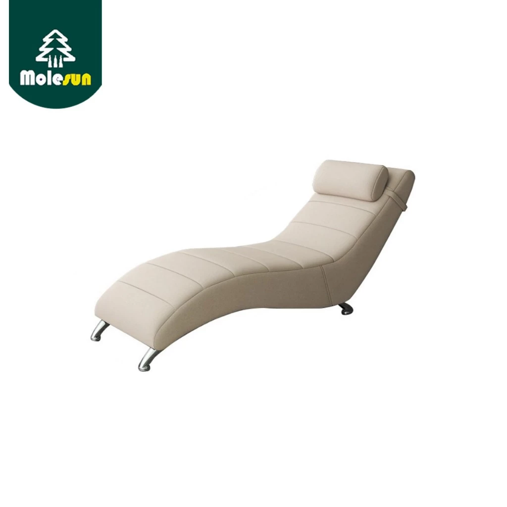

# 1. Chaise Lounge / Reclining Chair

**Last Updated**: 2025-11-01

## Specification Reference
See [SPEC.md Section 1](../SPEC.md#1-chaise-lounge--reclining-chair) for detailed requirements.

**Key Requirements from SPEC:**
- Type: Single-person lounger with reclining capability
- Dimensions: W65cm × L165cm (reclined)
- Material: Tech leather upholstery preferred
- Color: Beige/Cream tones
- Budget: ~฿3,000

---

## Product Options

### Option 1: Molesun Chaise Lounge (CURRENT SELECTION)

- **Link**: [Shopee Thailand](https://shopee.co.th/product/964300427/28055411040)
- **Price**: ฿2,999 (as of 2024-10-30)
- **Vendor**: Shopee Thailand
- **Product ID**: 964300427/28055411040
- **SKU**: th-11134207-7r98y-lxrru52aj5cf2c
- **Image**: `images/1-chaise-lounge-molesun.webp`
- **Brand**: Molesun
- **Material**: Tech Leather (หนังTech)
- **Color**: Beige/Cream
- **Dimensions**: W65cm × L165cm × H70cm
- **Availability**: In stock on Shopee
- **Shipping**: Free shipping (Shopee standard)
- **Warranty**: Check with seller
- **Notes**:
  - Currently selected option
  - Good reviews on Shopee
  - Budget-friendly
  - Tech leather is water-resistant and easy to clean
  - Compact size suitable for small spaces

### Option 2: HomePro Reclining Lounge Chair
- **Link**: TBD (visit HomePro store)
- **Price**: ฿4,500-฿6,500 (estimated)
- **Vendor**: HomePro
- **Material**: Fabric or PU leather options
- **Color**: Various colors available
- **Dimensions**: Similar size range
- **Availability**: Check local HomePro
- **Warranty**: Usually 1-year warranty
- **Notes**:
  - Higher quality construction
  - Better warranty support
  - Can test in-store before buying
  - More expensive than online options

### Option 3: Index Living Mall Lounge Chair
- **Link**: TBD (visit Index Living Mall)
- **Price**: ฿5,000-฿8,000 (estimated)
- **Vendor**: Index Living Mall
- **Material**: Premium fabric or leather
- **Color**: Modern color selections
- **Dimensions**: Varies by model
- **Availability**: Check local Index store
- **Warranty**: Typically 1-2 years
- **Notes**:
  - Premium brand with modern designs
  - Better quality materials and construction
  - Higher price point
  - Delivery and assembly services available

---

## Recommended Choice

**Current Selection: Option 1 - Molesun Chaise Lounge (฿2,999)**

**Reasoning:**
- Meets all size requirements (W65cm × L165cm fits available space)
- Within budget constraints
- Tech leather is practical for Thailand climate (easy to clean, water-resistant)
- Beige/cream color matches desired aesthetic
- Good customer reviews on Shopee
- Free shipping included

**Considerations:**
- Tech leather may not be as breathable as fabric (can be warm in hot weather)
- Lower price point may mean shorter lifespan than premium options
- Online purchase means cannot test before buying
- Warranty coverage unclear - confirm with seller

---

## Alternative Vendors to Research

**Online Marketplaces:**
1. **Lazada** - Check for similar models and compare prices
2. **Shopee** - Already sourced from here
3. **HomePro Online** - Check online inventory

**Physical Stores (Bangkok/Thailand):**
1. **HomePro** - Large selection, can test products
2. **Index Living Mall** - Premium furniture options
3. **Thai Watsadu** - Home improvement and furniture
4. **SB Furniture** - Affordable furniture chain
5. **Ikea** (if available) - Modern, affordable options

---

## Installation Notes

- Assembly required: Check product details
- Weight: Approximately 15-20kg (estimated)
- Floor protection: Consider floor protectors/pads under legs to prevent scratching
- Positioning: Place away from direct sunlight to prevent fading
- Cleaning: Use appropriate leather/fabric cleaner

---

## Questions to Ask Seller

1. Is assembly required? Are tools/instructions included?
2. What is the warranty period and coverage?
3. What is the weight capacity?
4. Is the tech leather genuine or synthetic?
5. What are the return/exchange policies?
6. Are replacement parts available (if mechanisms break)?
7. What is the expected delivery timeframe?
8. Is the color exactly as shown in photos?

---

## Related Items to Purchase

- Floor protectors/pads (to prevent floor scratching)
- Leather cleaner/conditioner (for tech leather maintenance)
- Throw pillows or cushions (for added comfort)
- Side table or tray (for placing drinks/books)
