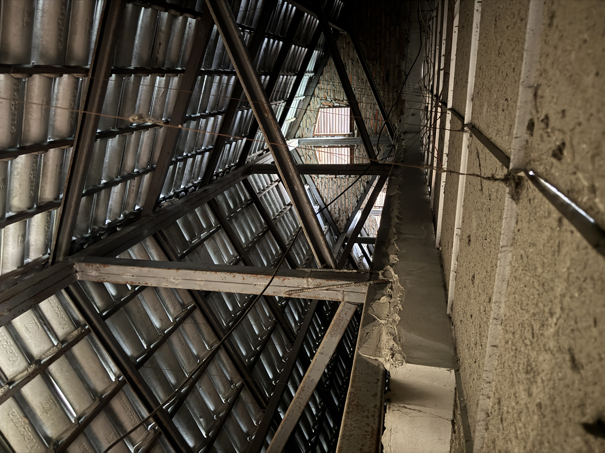
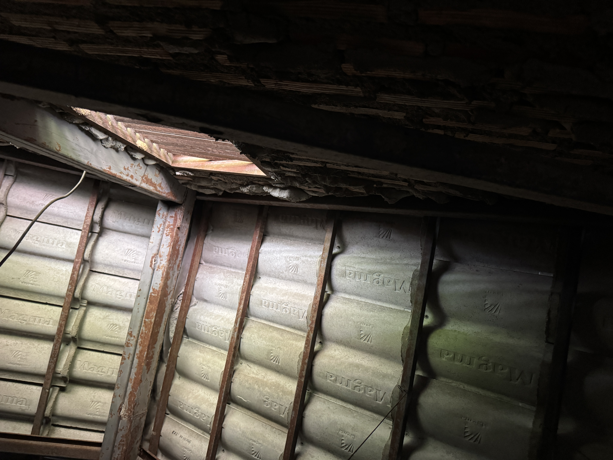
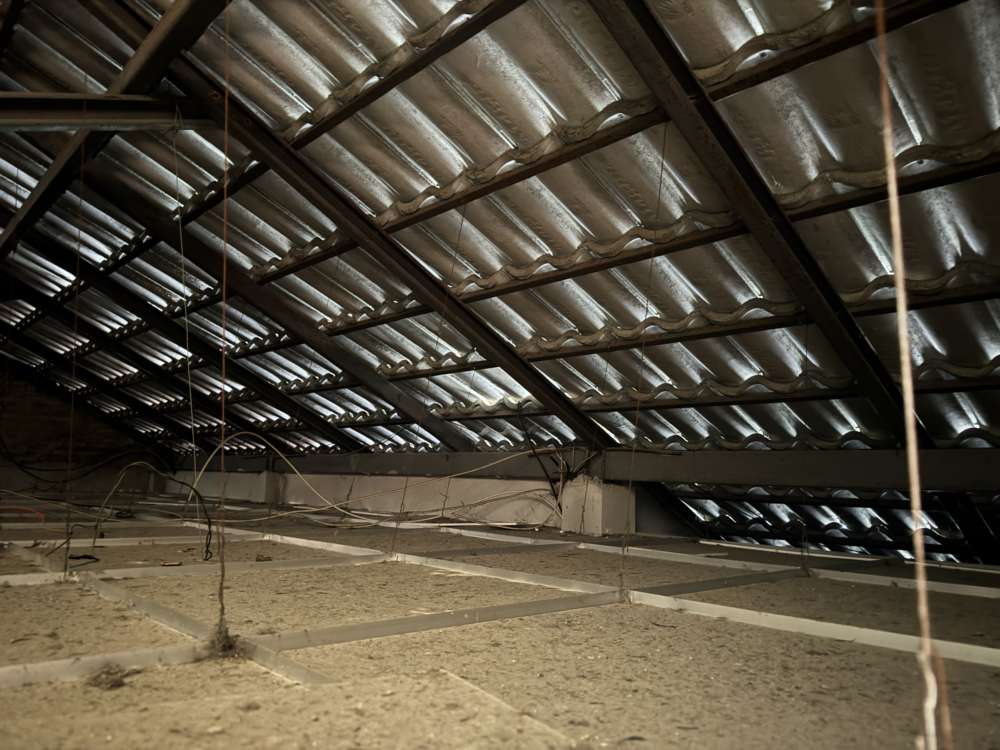
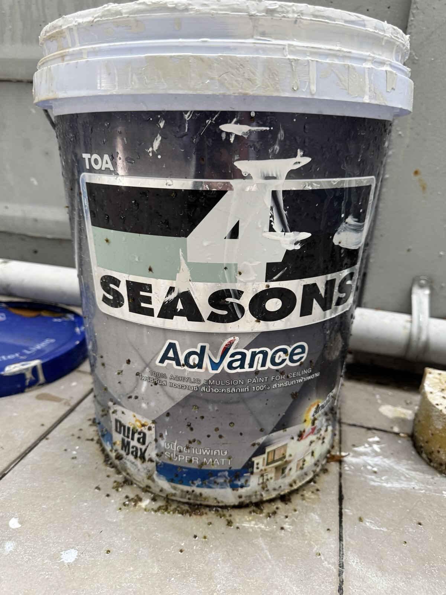
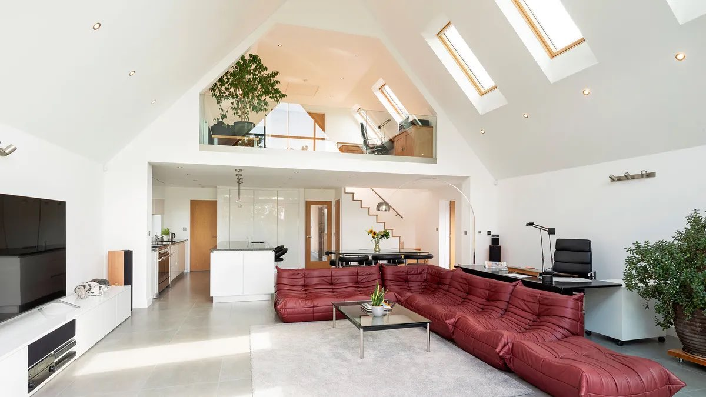

# House Renovation Photos

Documentation of existing conditions and design inspiration for the mon-house renovation project.

## Existing Roof Structure

### Interior Views

**Roof structure from inside** - Shows gable roof with metal tiles, wooden structural beams at eave level, and existing suspended ceiling below. No insulation visible.

**Close-up of roof tiles and beams** - Detail view showing "Magma" branded metal roof tiles and the wooden beam structure. The suspended ceiling is hung from these beams.

**Wide view of roof structure** - Full view of the gable roof interior showing the symmetrical pitch, metal tile covering, and the relationship between structural beams and suspended ceiling plane below.

**Key observations:**
- Metal tile roof (appears to be "Magma" brand)
- Wooden structural beams at eave level
- Suspended ceiling hung below beams
- No visible insulation between roof and ceiling
- Clean structural framework suitable for cathedral ceiling conversion

## Materials

### Ceiling Paint

**TOA 4 Seasons AdNance** - 100% acrylic emulsion paint for ceiling application. Super matt finish. This paint will be used for the new insulated cathedral ceiling.

## Design Inspiration

### Cathedral Ceiling Reference

**Design inspiration** - Modern cathedral ceiling with skylights and loft area. Shows the desired aesthetic for the renovation: bright white vaulted ceiling following the roof slope, skylights for natural light, and open plan living space with maximum ceiling height.

**Design goals based on this inspiration:**
- Cathedral ceiling following roof slope
- Insulated ceiling attached to roof underside
- Bright white finish for maximum light reflection
- Open plan living space
- Maximum vertical volume utilization

---

For technical specifications and measurements, see:
- [Existing design SPEC](../drawings/en/existing/SPEC.md)
- [Proposed design SPEC](../drawings/en/proposed/SPEC.md)
