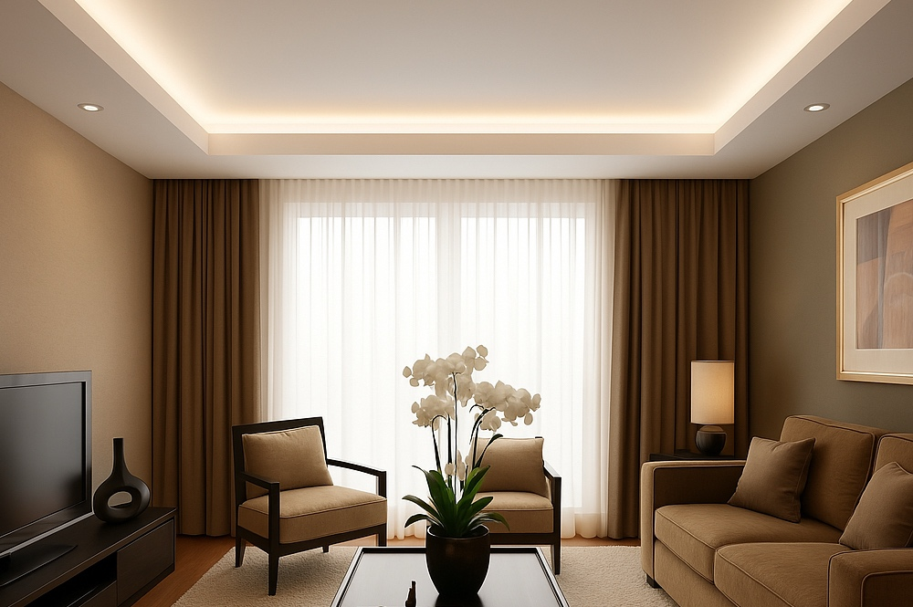
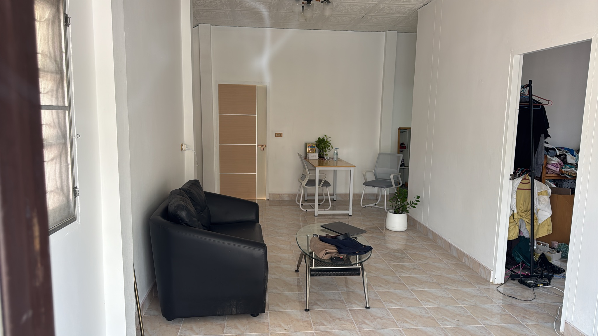

# Ceiling - Laem Chabang

Living room expanded to 7m × 7m by removing load-bearing wall and installing steel beam. Existing suspended ceiling (metal grid + tiles) stays in place. New plasterboard fixed to underside of existing grid. Foil-backed insulation laid on top of existing tiles to reduce heat. Tray/cove profile built below the flat board with hidden LED strip uplight and recessed downlights in centre panel.

**Order of work: structural (beam + wall) → insulation + flat plasterboard → tray frame → board tray → tape + set → paint → LED strip + downlights.**

---

## Dimensions

| Element | Measurement |
|---|---|
| Room | 7m × 7m |
| Flat ceiling area | 49 m² |
| Tray width (perimeter band) | ~0.6m (TBC on site) |
| Centre flat panel | ~5.8m × 5.8m = ~33.6 m² |
| Tray soffit (4 sides × 7m × 0.6m) | ~16.8 m² |
| Tray fascia drop (4 sides × 7m × height TBC) | TBC |
| LED strip perimeter | ~28 m |
| Downlights (centre panel, ~1 per 4m²) | ~8 pcs |

---

## Shopping List

### Insulation (ThaiWatsadu / HomePro)

| Product | What it does | Qty | Est. Price (THB) |
|---|---|---|---|
| Foil-backed bubble insulation 1.2m wide roll | Laid on top of existing suspended tiles. Reflects radiant heat from roof. | 6 rolls × 10m = 60 linear m (covers 55m² with overlap) | ~3,000-4,500 |
| Aluminium foil tape 50mm | Seal joins between insulation rolls | 2 rolls | ~200 |

### Plasterboard - Flat Ceiling (HomePro / ThaiWatsadu)

| Product | What it does | Qty | Est. Price (THB) |
|---|---|---|---|
| Gyproc moisture-resistant plasterboard 9mm (1.2m × 2.4m) | Flat ceiling skin fixed to existing suspended grid. Moisture-resistant for Thai climate. | 22 sheets (covers 55m² with 10% waste) | ~7,700-8,800 |
| Self-tapping drywall screws 25mm | Fix board to existing metal grid | 1 box (500 pcs) | ~250 |

### Tray Frame + Plasterboard (HomePro / ThaiWatsadu)

| Product | What it does | Qty | Est. Price (THB) |
|---|---|---|---|
| Metal furring channel C-section 0.55mm | Frame for tray perimeter and cove shelf | ~60m | ~3,000-4,200 |
| Wall angle track | Perimeter fixing at wall | ~28m | ~840-1,120 |
| Gyproc moisture-resistant 9mm (1.2m × 2.4m) | Board tray soffit and fascia | 10 sheets | ~3,500-4,000 |
| Drywall screws 35mm | Fix board to tray frame | 1 box (500 pcs) | ~280 |

### Finishing (HomePro)

| Product | What it does | Qty | Est. Price (THB) |
|---|---|---|---|
| Gyproc joint tape (paper) | Reinforce all board joins | 2 rolls × 90m | ~400 |
| Gyproc Covabase jointing compound | Fill, tape, and skim all surfaces. 3 coats. | 4 buckets × 20kg | ~2,800 |
| TOA Ceiling White Matt 1GL | Final paint. Matt finish hides imperfections on ceiling plane. | 4 cans (covers ~60m²) | ~3,200-3,600 |

### Lighting (HomePro / Lazada)

| Product | What it does | Qty | Est. Price (THB) |
|---|---|---|---|
| LED strip 3000K warm white 12V (5m reel) | Hidden in cove, uplight onto ceiling. Warm tone matches image reference. | 6 reels (30m for 28m perimeter + joins) | ~3,000-4,500 |
| LED driver / power supply 12V | Powers LED strip | 2 units | ~800-1,200 |
| Recessed downlight LED 7W warm white | Centre panel. Flush fit in plasterboard. | 8 pcs | ~2,400-3,200 |
| LED driver for downlights (if not built-in) | Powers downlights | 8 pcs (if needed) | ~0-800 |

---

## Cost Summary

| Category | Est. Cost (THB) |
|---|---|
| Foil insulation + tape | ~3,200-4,700 |
| Flat ceiling plasterboard + screws | ~7,950-9,050 |
| Tray frame + board | ~7,620-9,600 |
| Finishing (tape, compound, paint) | ~6,400-6,800 |
| LED strip + drivers | ~3,800-5,700 |
| Downlights | ~2,400-4,000 |
| **Materials total** | **~31,370-39,850** |

**Structural contractor (quoted)**

| Category | Est. Cost (THB) |
|---|---|
| Wall demo (5m load-bearing) + steel beam — all materials + labour | **8,000** |
| **Structural total** | **8,000** |

**Ceiling (DIY)**

| Category | Est. Cost (THB) |
|---|---|
| Labour (DIY) | 0 |
| **Ceiling labour total** | **0** |

| **PROJECT TOTAL (materials + structural contractor)** | **~39,370-47,850** |

> Get separate quotes from structural and ceiling contractors. Structural work (wall + beam) must complete and surfaces made good before ceiling contractor starts.

---

## Steps

### 1. Structural (separate contractor)
- Remove load-bearing wall between living room and 2 bedrooms
- Install steel beam to carry the load
- Make good wall surfaces before ceiling work starts

### 2. Insulation
- Lay foil-backed bubble insulation on top of existing suspended ceiling tiles
- Butt rolls tightly, overlap joins 50mm, tape all joins with foil tape
- No fixings needed — weight of the tiles holds it in place

### 3. Flat Plasterboard Ceiling
- Fix moisture-resistant 9mm Gyproc to underside of existing suspended grid using self-tapping screws at 300mm centres
- Stagger board joins — no cross joins
- Leave 2mm gap at all board edges for compound

### 4. Tray Frame
- Mark tray perimeter on new flat ceiling — ~600mm in from all walls (confirm on site)
- Fix wall angle track to all 4 walls at tray drop height
- Build cove shelf from furring channel: one horizontal ledge to sit LED strip on, one vertical fascia face
- Check level on all 4 sides before boarding

### 5. Board Tray
- Fix 9mm Gyproc to tray soffit (underside of cove shelf) and fascia (vertical face)
- Cut boards to width — typical strips 600mm wide
- Screw at 200mm centres on all framing members

### 6. Tape and Set (3 coats)
- **Coat 1** — Bed paper tape into compound on all joins and internal angles. Fill screw heads flush.
- **Coat 2** — Wider skim coat over tape (feather 150mm each side). Let dry fully.
- **Coat 3** — Light skim over entire surface. Sand between coats with 120 grit.
- Sand final coat with 180 grit. Wipe dust before painting.

### 7. Paint
- Prime all bare compound with diluted PVA or ceiling primer
- 2 coats TOA Ceiling White Matt — roll on, cut in at tray junction by brush

### 8. LED Strip + Downlights
- Lay LED strip in cove channel on tray shelf, facing up toward ceiling
- Run 12V cable back to driver location (above ceiling or in wall void)
- Cut downlight holes in centre panel using hole saw (size to match downlight trim)
- Drop downlight fittings through, connect to mains via licensed electrician
- Test all lighting before closing any access points

---

## Notes

- Moisture-resistant board throughout — Thailand humidity will cause plain board to sag over time
- 3000K warm white LED throughout — matches the warm tone in the reference image
- Confirm tray width and drop height on site once flat ceiling is done — proportions depend on actual ceiling height
- LED strip needs a clean flat shelf to sit on — tray frame must be dead level or the reflected light will show the unevenness
- Downlight positions: sketch on paper before cutting holes — easy to add, impossible to undo
- All electrical work (mains wiring for downlights, driver installation) requires a licensed Thai electrician
