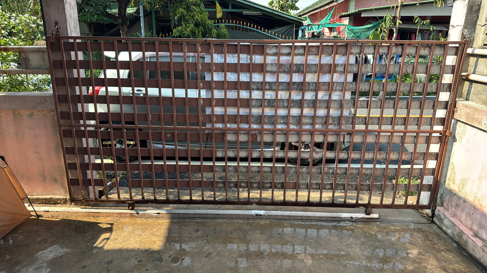
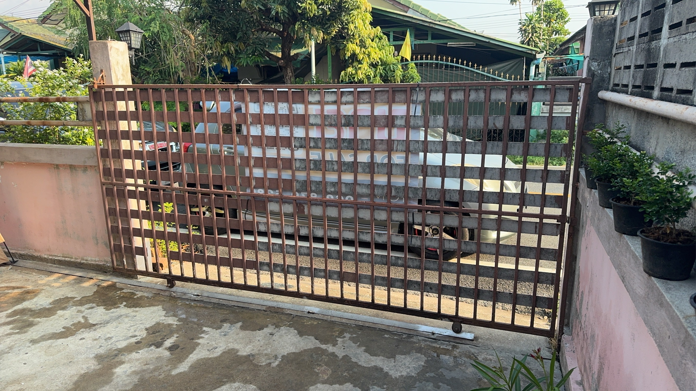
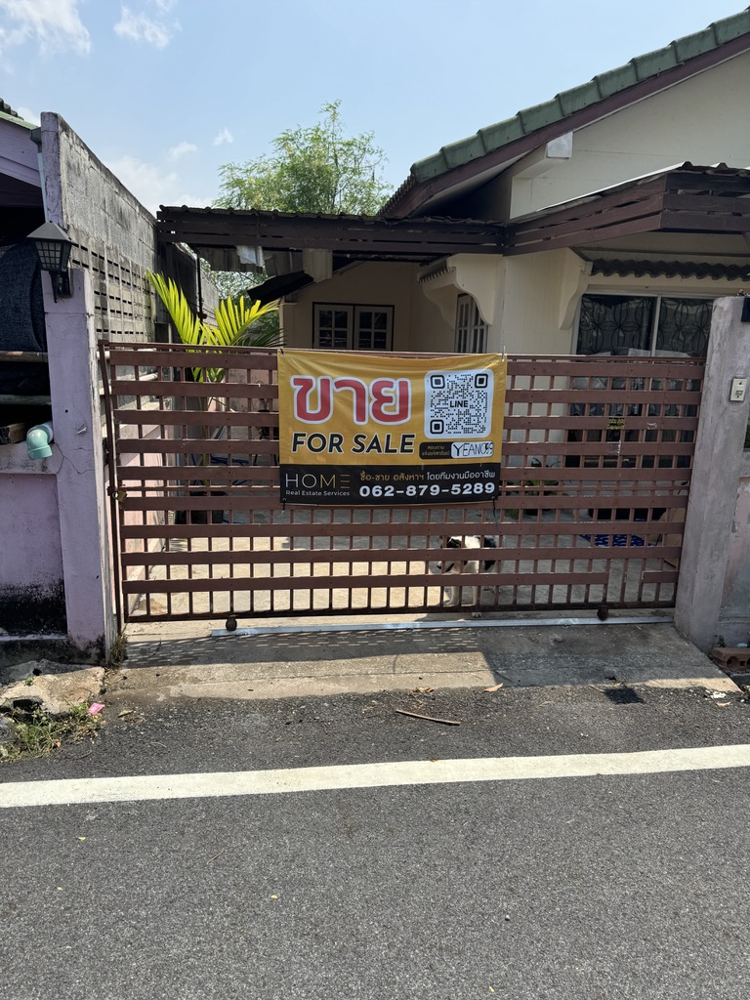
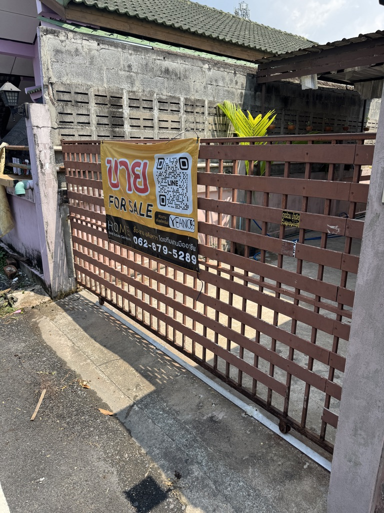
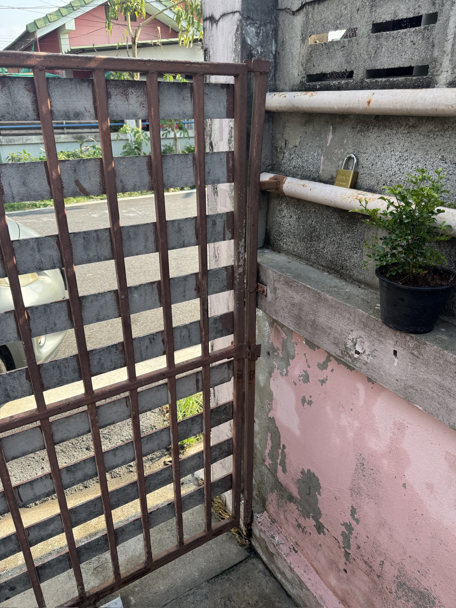
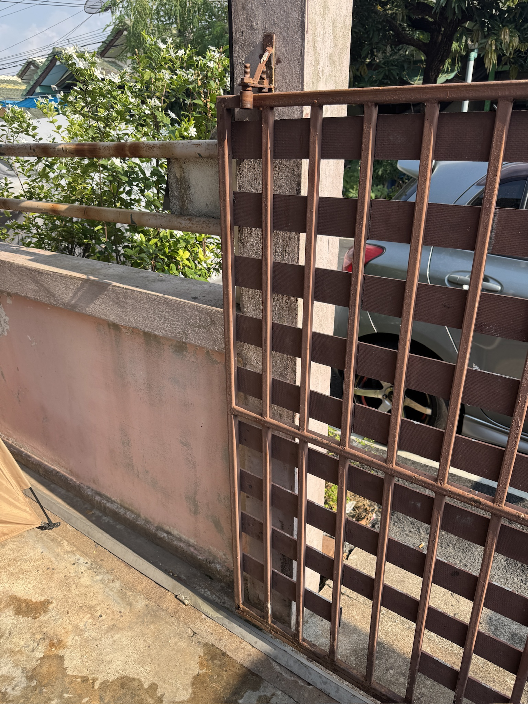
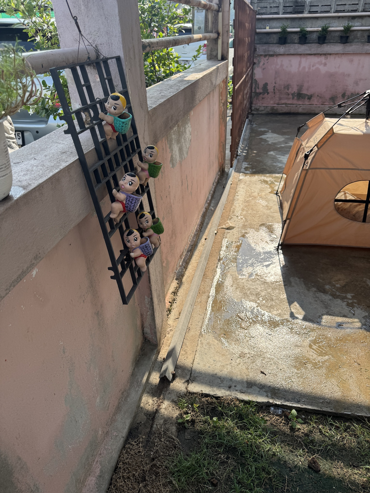

# ประตู - แหลมฉบัง

เปลี่ยนประตูบานเลื่อนเหล็กหนักที่เป็นสนิมด้วยประตูอะลูมิเนียมน้ำหนักเบา

**ข้อกำหนด: ประตูบานเลื่อนกว้าง 3.5 เมตร × สูง 1.5 เมตร สีดำอวกาศ วัสดุอะลูมิเนียมล้วน ไม่เป็นสนิม**

---

## ตัวเลือกที่แนะนำ: ALNEX Prive — ประตูบานเลื่อนอะลูมิเนียม

ประตูอะลูมิเนียม T6 ล้วน น้ำหนักเบากว่าเหล็ก 3 เท่า แข็งแรงกว่าอะลูมิเนียมทั่วไป 1.5 เท่า ไม่เป็นสนิม ไม่ต้องทาสีตลอดอายุการใช้งาน มีให้เลือกในสี **ดำอวกาศ** (ผิวกึ่งเงา)

- **รุ่น**: Prive (Standard Series)
- **วัสดุ**: อะลูมิเนียม T6
- **สี**: ดำอวกาศ
- **น้ำหนัก**: เบากว่าประตูเหล็กเดิมประมาณ 3 เท่า
- **ระบบขับเคลื่อน**: ผลักด้วยมือ
- **ขนาดสูงสุด**: สูงไม่เกิน 3 เมตร × กว้างไม่เกิน 15 เมตร — ขนาด 3.5×1.5 เมตรของเราอยู่ในช่วงที่รองรับได้
- **พื้นที่**: 3.5 × 1.5 = **5.25 ตร.ม.**
- **ราคา**: 16,000 บาท/ตร.ม. → **ประมาณ 84,000 บาท** สำหรับ 5.25 ตร.ม.
- **ผู้จำหน่าย**: [ALNEX Thailand — Gate](https://www.alnexthailand.com/en/gate/) | โทร: 02-136-8899 | LINE: [ALNEX](https://lin.ee/w9gnJzU)

---

## ขนาด

| รายการ | ค่า |
|---|---|
| ความกว้างประตู | 3.5 ม. |
| ความสูงประตู | 1.5 ม. |
| พื้นที่ประตู | 5.25 ตร.ม. (3.5 × 1.5) |
| ประเภทราง | ลูกล้อด้านล่าง (รางเดิมอาจนำกลับมาใช้ได้) |
| ทิศทางการเปิด | เลื่อนซ้ายหรือขวา (ยืนยันหน้างาน) |

---

## รายการวัสดุ

| สินค้า | หน้าที่ | จำนวน | ราคาประมาณ (บาท) |
|---|---|---|---|
| ALNEX Prive สีดำอวกาศ ขนาด 3.5 ม. × 1.5 ม. | ตัวประตูหลัก สั่งผลิตตามขนาด | 1 | ประมาณ 84,000 (TBC) |
| ลูกล้อด้านล่าง | รับน้ำหนักประตูบนราง | 2 | ประมาณ 300–600 บาท/ตัว หากไม่รวมในชุด |
| รางด้านล่าง | ร่องพื้นสำหรับลูกล้อ | 1 × 3.5 ม. | ประมาณ 300–500 หากไม่รวมในชุด |
| เสาหยุด | หยุดประตูที่ปลายทางเปิด | 1 | ประมาณ 500–1,000 หากไม่รวมในชุด |
| ตัวนำด้านข้าง | ยึดประตูให้ตั้งตรง | 1 ชุด | ประมาณ 200–400 หากไม่รวมในชุด |

---

## สรุปค่าใช้จ่าย

| รายการ | ค่าใช้จ่ายประมาณ (บาท) |
|---|---|
| ประตู (ค่าวัสดุ) | ประมาณ 84,000 |
| อุปกรณ์ (ลูกล้อ, ราง, เสาหยุด, ตัวนำ) | ประมาณ 0 หากรวมในชุด / ประมาณ 1,500–2,500 หากแยกต่างหาก |
| ค่าแรง (ถอดประตูเก่า, ติดตั้งประตูใหม่) | ประมาณ 1,500–3,000 |
| **รวมค่าใช้จ่ายประตู** | **ประมาณ 85,500–89,500** |

---

## ขั้นตอนการดำเนินงาน

1. ถอดประตูเก่าออกและนำไปขายเป็นเศษเหล็ก
2. ตรวจสอบรางด้านล่างเดิม — นำกลับมาใช้หากตรงและสภาพดี เปลี่ยนใหม่หากงอหรือเป็นสนิม
3. ติดต่อ ALNEX (02-136-8899 / LINE \@ALNEX) — ขอใบเสนอราคาสำหรับ Prive สีดำอวกาศ ขนาด 3.5 ม. × 1.5 ม. แบบบานเลื่อนผลักมือ **สอบถามโดยตรงว่า ราคารวมลูกล้อ รางด้านล่าง เสาหยุด และตัวนำด้านข้างหรือไม่**
5. ติดตั้งประตูบนลูกล้อด้านล่าง
6. ติดตั้งแผงนำด้านบนกับผนัง/เสา
7. ทดสอบการเลื่อน — ปรับลูกล้อให้เลื่อนได้ราบรื่น

---

## หมายเหตุ

- **สอบถาม ALNEX โดยตรงว่า ราคารวมลูกล้อ รางด้านล่าง เสาหยุด และตัวนำด้านข้างหรือไม่** แบรนด์ระดับพรีเมียมมักรวมอุปกรณ์ฮาร์ดแวร์มาด้วย แต่ควรยืนยันก่อนสั่งซื้อ
- รางด้านล่างเดิมอาจนำกลับมาใช้ได้ — ตรวจสอบความตรงและสภาพสนิมก่อนสั่งรางใหม่
- อะลูมิเนียม T6 ไม่ต้องการการบำรุงรักษาใดๆ และไม่ต้องทาสีตลอดอายุการใช้งาน