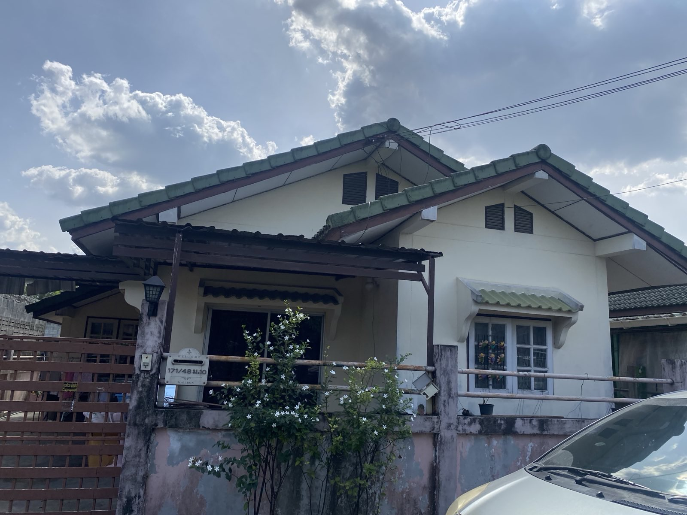
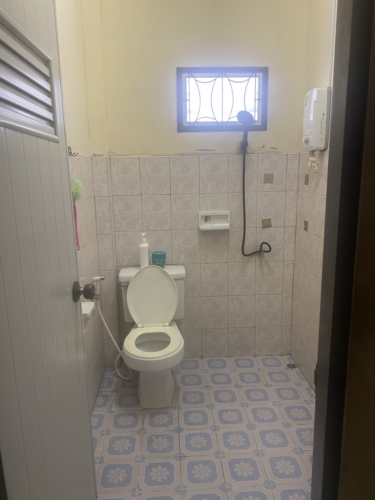
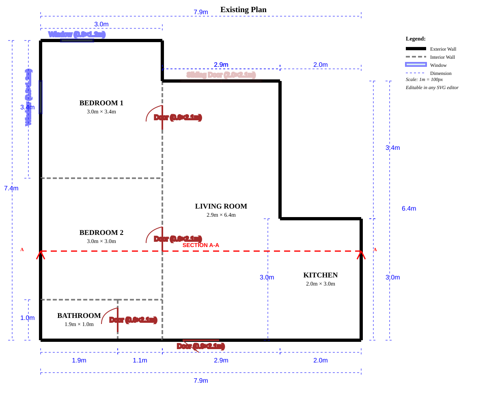

# Pim's House Sale

Selling a detached house in Laem Chabang, Chonburi.

## Property Summary

| | |
|---|---|
| **Address** | 171/48 Moo 10, Nongklamai Raod, Bueng, Sriracha, Chonburi 20230, Thailand |
| **Type** | Detached single-story house |
| **Land** | 33 sq wah (132 sq m) |
| **Living Area** | 60 sq m |
| **Bedrooms** | 2 |
| **Bathrooms** | 1 |
| **Age** | 16 years |
| **Features** | A/C in master bedroom, tiled roof |

## Legal Title

Chanode:  103765

Village Name: Praewhouse

Detached" Confirmation: There a gap of at least 2 meters around the entire house.

Street Feel: Its NOT an estate or Project. Its a normal Street with all the same detached houses on the street and a small garden area in front. Its a cul-de-sac street.

## Photos

| | |
|---|---|
|  |  |
|  |  |
|  |  |

## Floor Plan

## Documents

| File | Description |
|------|-------------|
| [legal.md](legal.md) | Chanote, Tabien Baan, owner details, debt info |
| [process.md](process.md) | Full valuation details & repair recommendations |
| [contacts.md](contacts.md) | Estate agents & Facebook groups |
| [estate-agent-template.md](estate-agent-template.md) | Email templates for agents (Thai/English) |

## Quick Links

**Estate Agents (with email):**
- A House Sriracha: ahouse2516@gmail.com
- One Stop Real Estate: info@1stop-pattaya.com

**Facebook Groups:**
- [ซื้อขายบ้าน พัทยา ชลบุรี ศรีราชา](https://facebook.com/groups/pattayapropertyclick/)
- [ขายบ้าน ศรีราชา บ่อวิน](https://facebook.com/groups/363843700473206/)

## Next Steps

1. [ ] Contact estate agents for valuation advice
2. [ ] Decide on asking price
3. [ ] Do recommended repairs
4. [ ] Take new photos after staging
5. [ ] List with agents + post to Facebook groups
